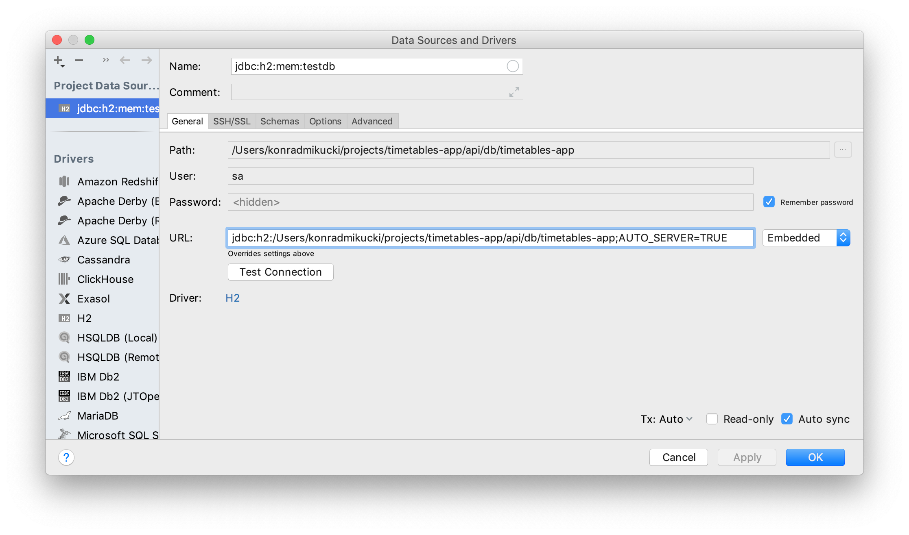

# Timetable App Api

For building project use

```
./gradlew build
```

To run Tomcat Server use

```
./gradlew bootRun
```

Api will be available on

```
http://localhost:8080/swagger-ui.html
```

## Connecting to database

H2 console will be available on:

```
http://localhost:8080/h2-console
```

For Intellij's DB tool you need analogous config:



check `src/main/resources/application.properties` for details.
